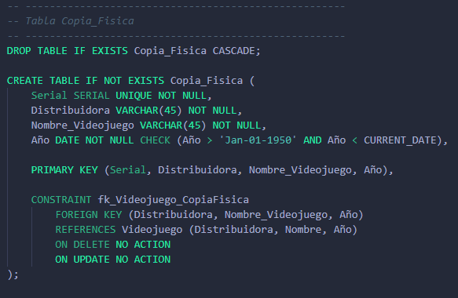

# **PROYECTO: Servicio de subscripción de Indev**
## **Autores:**
* Jaime Simeón Palomar Blumenthal - ALU0101228587
* Alberto Cruz Luis - ALU0101217734
* Cristo García González - ALU0101204512
* Antonella Sofía García Álvarez - ALU0101227610

### **Índice**

1. [Tablas para almacenar Usuarios](#usuarios)
2. [Tablas para almacenar Videojuegos](#videojuegos)
3. [Categorías de videojuegos](#categorias)
4. [Los usuarios filtran por categorías](#filtran)
5. [Los videojuegos pertenecen a categorías](#pertenecen)
5. [Copias físicas de videojuegos](#cpfisicas)
6. [Los usuarios _Deluxe_ reciben copias físicas](#reciben)
7. [Pruebas de producción](#prod-test)

### **Tablas para almacenar Usuarios** <a name="usuarios"/>
Existen tres tablas que definen una relación IS_A entre los usuarios totales, los básicos, los _Deluxe_ y los _Premium_.

La tabla _Usuario_ contiene todos los datos de todos los usuarios:

Los nombres de usuarios han de ser únicos, de ahí la restricción _UNIQUE_.

Por su parte, la tabla **Basico** contiene los datos de los usuarios básicos, y la tabla **No_Basicos** la de los usuarios No Básicos, que a su vez pueden ser _Deluxe_ o _Premium_. Est último se restringe mediante la sentencia _CHECK_.

### **Tablas para almacenar Videojuegos** <a name="videojuegos"/>
Al igual que con los usuarios, existen tres tablas que definen una relación IS_A entre los videojuegos totales, los externos, los internos de reciente lanzamiento, y los internos de NO reciente lanzamiento.

La tabla _Videojuego_ contiene todos los datos de todos los videojuuegos:

El PEGI de un videojuego es la edad mínima recomendada para jugarlo. Es una normativa europea y define 5 estándares PEGI: 3, 7, 12, 16 y 18 años. De ahí que se limite el atributo PEGI a estos cinco valores mediante la restricción _CHECK_.

Además, la fecha de publicación del título especificada en el atributo año tiene que ser posterior a 1950 y anterior al día actual.

Por otro lado, la tabla **Externo** contiene los videojuegos no desarrollados por la empresa que ofrece el servicio de subscripción, por lo que se añade el atributo _Desarrolladora_.

Además, los videojuegos desarrollados por la empresa que ofrece el servicio de subscripción (en adelante **_InDev_**) se almacenan en la tabla **De_Indev**. Como pueden ser _Recientes_ o _No Recientes_ respecto a su fecha de lanzamiento, se añade el atributo _Tipo_ y se limita su dominio a estos dos valores.

### **Categorías de videojuegos** <a name="categorias"/>
Los videojuegos se organizan por categorías según los géneros a los que pertenezcan (_Shooter_, _Estrategia_, etc). Además, de cada categoría nos interesa guardar cuántos títulos hay en ella.

### **Los usuarios filtran por categorías** <a name="filtran"/>
El servicio dispondrá de una barra de búsqueda con filtros por categorías para facilitar la navegación de los usuarios, y por fines estadísticos y para mejorar las recomendaciones se pretende guardar un histórico con las búsquedas de cada usuario. Por esto debemos disponer de una tabla **Filtra** que relacione al usuario con la categoría que buscó y en qué día.

### **Los videojuegos pertenecen a categorías** <a name="pertenecen"/>
Cada videojuego puede tener varios géneros, y cada categoría puede tener muchos títulos diferentes. Por eso, la relación muchos a muchos entre **Videojuego** y **Categoria** se representa mediante la tabla **Pertenece**.

### **Copias físicas de videojuegos** <a name="cpfisicas"/>
Algunos usuarios recibirán copias físicas de algunos videojuegos, por lo que se almacenan e identifican por un serial.

La clave ajena (Distribuidora, Nombre_Videojuego, Año) crea una relación de uno a muchos entre **Videojuego** y **Copia_Fisica** dado que una copia física sólo puede venir de un videojuego, pero un videojuego sí puede tener varias copias físicas.

### **Los usuarios _Deluxe_ reciben copias físicas** <a name="reciben"/>
Sólamente los usuarios No Básicos con tipo _Deluxe_ pueden recibir copias físicas (la comprobación del tipo se implementa más adelante mediante un trigger). 