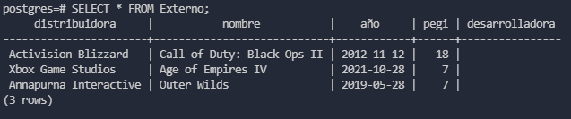
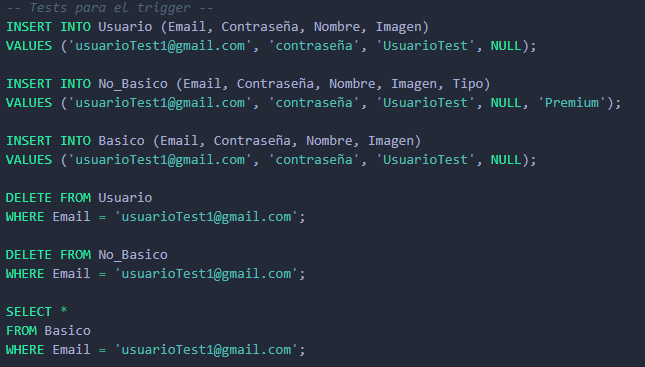

# **PROYECTO: Servicio de subscripción de Indev**
## **Autores:**
* Jaime Simeón Palomar Blumenthal - ALU0101228587
* Alberto Cruz Luis - ALU0101217734
* Cristo García González - ALU0101204512
* Antonella Sofía García Álvarez - ALU0101227610

### **Índice**

1. [Tablas para almacenar **Usuarios**](#usuarios)
2. [Tablas para almacenar **Videojuegos**](#videojuegos)
3. [**Categorías** de videojuegos](#categorias)
4. [Los usuarios **filtran** por categorías](#filtran)
5. [Los videojuegos **pertenecen** a categorías](#pertenecen)
6. [**Copias físicas** de videojuegos](#cpfisicas)
7. [Los usuarios Básicos **juegan** a videojuegos](#juegabasico)
8. [Los usuarios No Básicos **juegan** a videojuegos](#jueganobasico)
9. [Los usuarios No Básicos **juegan a videojuegos online** entre ellos](#juegaonline)
10. [Comprobar la inserción en **Basico y No_Basico**](#checkbasicoinsert)

### **Tablas para almacenar Usuarios** <a name="usuarios"/>
Existen tres tablas que definen una relación IS_A entre los usuarios totales, los básicos, los _Deluxe_ y los _Premium_.

La tabla _Usuario_ contiene todos los datos de todos los usuarios:

Los nombres de usuarios han de ser únicos, de ahí la restricción _UNIQUE_.

Por su parte, la tabla **Basico** contiene los datos de los usuarios básicos, y la tabla **No_Basicos** la de los usuarios No Básicos, que a su vez pueden ser _Deluxe_ o _Premium_. Est último se restringe mediante la sentencia _CHECK_.

### **Tablas para almacenar Videojuegos** <a name="videojuegos"/>
Al igual que con los usuarios, existen tres tablas que definen una relación IS_A entre los videojuegos totales, los externos, los internos de reciente lanzamiento, y los internos de NO reciente lanzamiento.

La tabla _Videojuego_ contiene todos los datos de todos los videojuuegos:

El PEGI de un videojuego es la edad mínima recomendada para jugarlo. Es una normativa europea y define 5 estándares PEGI: 3, 7, 12, 16 y 18 años. De ahí que se limite el atributo PEGI a estos cinco valores mediante la restricción _CHECK_.

Además, la fecha de publicación del título especificada en el atributo año tiene que ser posterior a 1950 y anterior al día actual.

Por otro lado, la tabla **Externo** contiene los videojuegos no desarrollados por la empresa que ofrece el servicio de subscripción, por lo que se añade el atributo _Desarrolladora_.

Además, los videojuegos desarrollados por la empresa que ofrece el servicio de subscripción (en adelante **_InDev_**) se almacenan en la tabla **De_Indev**. Como pueden ser _Recientes_ o _No Recientes_ respecto a su fecha de lanzamiento, se añade el atributo _Tipo_ y se limita su dominio a estos dos valores.

### **Categorías de videojuegos** <a name="categorias"/>
Los videojuegos se organizan por categorías según los géneros a los que pertenezcan (_Shooter_, _Estrategia_, etc). Además, de cada categoría nos interesa guardar cuántos títulos hay en ella.

### **Los usuarios filtran por categorías** <a name="filtran"/>
El servicio dispondrá de una barra de búsqueda con filtros por categorías para facilitar la navegación de los usuarios, y por fines estadísticos y para mejorar las recomendaciones se pretende guardar un histórico con las búsquedas de cada usuario. Por esto debemos disponer de una tabla **Filtra** que relacione al usuario con la categoría que buscó y en qué día.

### **Los videojuegos pertenecen a categorías** <a name="pertenecen"/>
Cada videojuego puede tener varios géneros, y cada categoría puede tener muchos títulos diferentes. Por eso, la relación muchos a muchos entre **Videojuego** y **Categoria** se representa mediante la tabla **Pertenece**.

### **Copias físicas de videojuegos** <a name="cpfisicas"/>
Sólamente los usuarios No Básicos con tipo _Deluxe_ reciben copias físicas de algunos videjouegos (la comprobación del tipo se implementa más adelante mediante un trigger), por lo que se almacenan e identifican por un serial.

La clave ajena (Distribuidora, Nombre_Videojuego, Año) crea una relación de uno a muchos entre **Videojuego** y **Copia_Fisica**,  dado que una copia física sólo puede venir de un videojuego, pero un videojuego sí puede tener varias copias físicas.

La clave ajena (Email_NoBasico) crea una relación de uno a muchos entre **No_Basico** y **Copia_Fisica**, dado que una copia física sólo puede ser enviada a un usuario No Básico, pero un usuario No Básico puede recibir varias copias físicas.

### **Los usuarios Básicos juegan a videojuegos** <a name="juegabasico"/>
Los usuarios Básicos eligen entre jugar exclusivamente a juegos Externos o De Indev al jugar a su primer título. Esto es representado mediante las tablas **Juega1** y **Juega2**. En ambas sólo pueden entrar usuarios Básicos, en **Juega1** sólo pueden insertarse videojuegos Externos y en **Juega2** sólo juegos De Indev de tipo _Reciente_. Todas estas comprobaciones se realizan mediante un trigger que se explicará más adelante.

### **Los usuarios No Básicos juegan a videojuegos** <a name="jueganobasico"/>
Los usuarios Nos Básicos pueden jugar a cualquier videojuego sin restricciones. Esta relación muchos a muchos se representa mediante la tabla **Juega3**:

### **Los usuarios **No Básicos** juegan a videojuegos online entre ellos** <a name="juegaonline"/>
Los usuarios No Básicos disponen de servidores dedicados para fomentar el juego online. Al ser usuarios de la tabla **No_Basico** los que juegan entre ellos a videojuegos de la tabla **Videojuegos** se considera una relación terciaria, representada por la tabla **Juega_Online**.

Podemos observar como existen dos claves ajenas que referncian a **No_Basico** y una que referencia a **Videojuego**.

### **Comprobar la inserción en Basico y No_Basico** <a name="checkbasicoinsert"/>
En el modelo, en ambas relaciones IS_A las subtablas no pueden compartir entradas entre ellas. Esto se comprueba mediante los trigges **Check_Basico_Insert** y **Check_NoBasico_Insert**:

Ambos triggers hacen lo mismo: comprueban que los datos insertados no están en la tabla contraria antes de insertarlos y, si lo están lanzan un mensaje de error.

Para comprobar su funcionamiento se trata de insertar datos erróneos duplicados para provocar la activación de los triggers.

Además, también se modelizó que todos los usuarios de **Basico** y **No_Basico** debían estar en **Usuario**.